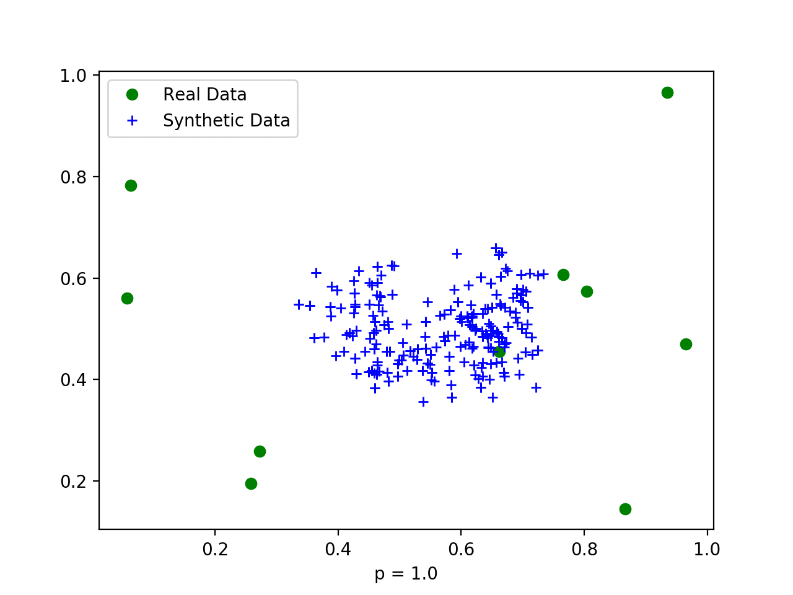

# LSI

Implementation of local synthetic instances (LSI) oversampling method. The LSI method is described in this MICCAI 2015 paper [PDF](http://www.sfu.ca/~cjbrown/pdfs/miccai2015a.pdf)|[DOI](https://doi.org/10.1007/978-3-319-24553-9_9)

Note that matplotlib.pyplot is required to run the demo but not to use the core LSI function.

You may use and distribute this code freely, but if you use it for academic purposes, please cite the above paper as:

> Brown, Colin J., Steven P. Miller, Brian G. Booth, Kenneth J. Poskitt, Vann Chau, Anne R. Synnes, Jill G. Zwicker, Ruth E. Grunau, and Ghassan Hamarneh. "Prediction of motor function in very preterm infants using connectome features and local synthetic instances." In International Conference on Medical Image Computing and Computer-Assisted Intervention (MICCAI), pp. 69-76. Springer, Cham, 2015.
